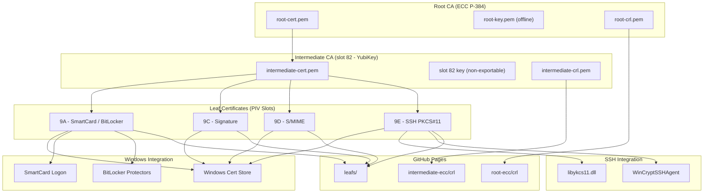
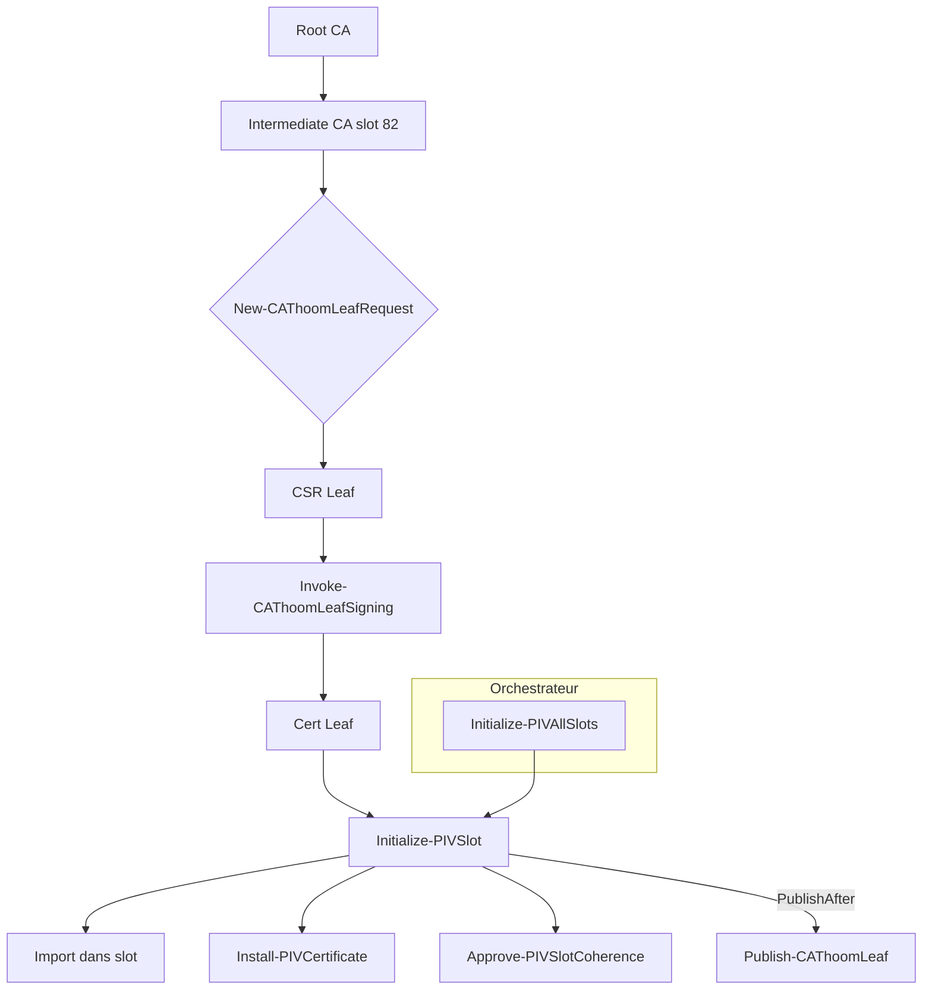

# 📘 Thomas‑PKI — Public Certificate Repository

Ce dépôt contient les artefacts publics de la PKI personnelle **CA‑Thoom**, utilisés pour :

- la validation de certificats PIV/SSH  
- la vérification de la chaîne de confiance  
- la vérification de révocation via CRL  
- la publication statique via GitHub Pages  

Ce dépôt **ne contient aucune clé privée**.  
Il expose uniquement les éléments nécessaires à la validation publique.

---
## 🔐 PKI Status


### CRL Last Update (Dynamic)


## 📁 Structure du dépôt

```
Thomas-PKI/
│
├── root-ecc/
│   ├── certs/
│   │   └── root-cert.pem
│   └── crl/
│       └── root-crl.pem
│
├── intermediate-ecc/
│   ├── certs/
│   │   └── intermediate-cert.pem
│   └── crl/
│       └── intermediate-crl.pem
│
└── leafs/
    ├── 9A/
    │   └── 9A-cert.pem
    ├── 9C/
    │   └── 9C-cert.pem
    ├── 9D/
    │   └── 9D-cert.pem
    └── 9E/
        └── 9E-cert.pem
```

---

## 🏛️ PKI Overview

La PKI CA‑Thoom suit une architecture classique :

```
Root CA (offline)
   ↓ signs
Intermediate CA (online)
   ↓ signs
Leaf Certificates (PIV/SSH)
```

- La **Root CA** est utilisée uniquement pour signer l’Intermediate.  
- L’**Intermediate CA** signe les certificats utilisateurs (leafs).  
- Les leafs sont utilisés pour PIV, SSH, authentification, signature, etc.

---

## 🔐 Certificats publiés

### Root CA
- `root-ecc/certs/root-cert.pem`  
  → Certificat public de la Root CA  
- `root-ecc/crl/root-crl.pem`  
  → CRL Root (rarement utilisée)

### Intermediate CA
- `intermediate-ecc/certs/intermediate-cert.pem`  
  → Certificat public de l’Intermediate  
- `intermediate-ecc/crl/intermediate-crl.pem`  
  → CRL utilisée pour la révocation des leafs

### Leaf Certificates
- `leafs/<slot>/<slot>-cert.pem`  
  → Certificats PIV (9A, 9C, 9D, 9E)

---

## 🔗 CDP & AIA (Distribution Points)

Les certificats leafs contiennent :

### **AIA (Authority Information Access)**  
→ Permet de télécharger le certificat de l’Intermediate  
```
https://nathom78.github.io/Thomas-PKI/intermediate-ecc/certs/intermediate-cert.pem
```

### **CDP (CRL Distribution Point)**  
→ Permet de télécharger la CRL Intermediate  
```
https://nathom78.github.io/Thomas-PKI/intermediate-ecc/crl/intermediate-crl.pem
```

Ces URLs sont intégrées automatiquement lors de la génération des certificats.

---

## 🧪 Vérification d’un certificat

### Sous Windows
Double‑cliquer sur un certificat → onglet **Détails** → **Afficher les propriétés du certificat**.

Windows :

1. télécharge automatiquement la CRL  
2. vérifie la signature  
3. vérifie si le certificat est révoqué  
4. reconstruit la chaîne Root → Intermediate → Leaf

### Sous OpenSSL

```
openssl verify -crl_check -CAfile intermediate-cert.pem leaf-cert.pem
```

---

## 🔄 Mise à jour du dépôt

Les fichiers sont publiés automatiquement via :

- `Publish-CAThoomCRL.ps1` (Root)
- `Publish-CAThoomCRLIntermediate.ps1` (Intermediate)
- `Publish-CAThoomLeaf.ps1` (Leafs)
- `Update-PKIGitHub.ps1` (git add/commit/push)

---

## ⚠️ Sécurité

Ce dépôt **ne contient aucune clé privée** :

- pas de `root-key.pem`  
- pas de `intermediate-key.pem`  
- pas de clés PIV  

Seuls les artefacts publics nécessaires à la validation sont publiés.

---

## 📄 Licence

Usage personnel, pédagogique et expérimental.

## 🖼️ Diagramme Mermaid — Architecture CA‑THOOM‑PIV‑SSH v2





